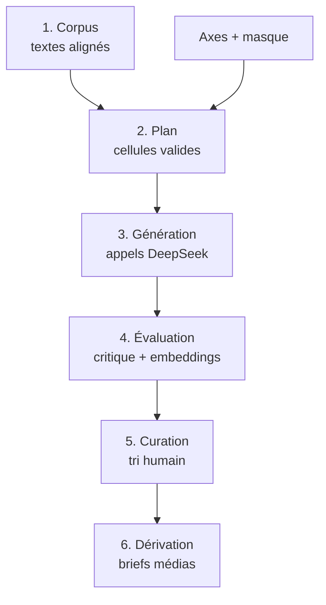
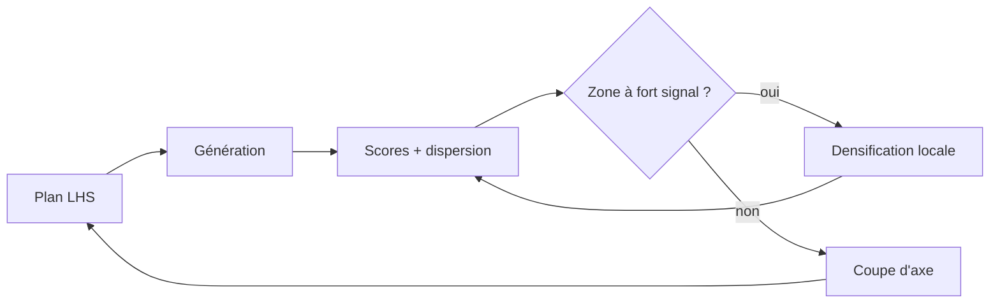

# Spec technique — Pipeline d'exégèse combinatoire (Tao-tö king)

2026-09-17 · Nicolas Bridelance

## 1. Objectif et périmètre

Le pipeline produit un **corpus tracé d'éclairages générés**, indexé par les coordonnées de l'espace des axes qui l'a produit, plus les métriques permettant de décider quels axes portent du sens et quelles cellules méritent une lecture humaine. Il ne produit pas le commentaire lui-même : il en produit la matière première et les instruments de tri.

| Hors périmètre | Raison |
| --- | --- |
| L'exégèse finale rédigée | Synthèse humaine en aval, pas une sortie de matrice |
| Artefacts médiatiques (vidéo, jeu, image) | Étage distinct, appliqué à du matériau déjà curé (§2) |
| Le « programme de vie » | Sortie éditoriale, pas une case |
| Diffusion à des tiers | Le dépôt est public, mais c'est un dépôt de code et de sources domaine public ; publier la matière générée ou le corpus curé est une décision éditoriale séparée, non prise ici |

Quatre contraintes structurent tout le reste :

- **Reproductibilité** : toute sortie est re-générable depuis sa ligne en base (prompt versionné, modèle, paramètres, seed).
- **Le goulot est la lecture humaine, pas le calcul.** L'architecture optimise le ratio cellules lues / cellules retenues, jamais le débit de génération.
- **Rejouabilité** : relancer une matrice identique sur un modèle futur et comparer les deux passes doit être une commande, pas un chantier.
- **Coût plafonné par run**, avec arrêt dur (§10).

Les valeurs chiffrées de ce document (nombre d'axes, seuils, tailles d'échantillon) sont des hypothèses à falsifier par le spike du §11, pas des décisions arrêtées.

## 2. Architecture générale

Six étages, chacun matérialisé par une table en base et une commande CLI. La frontière dure est entre l'étage 3 (génération, machine, massif) et l'étage 5 (curation, humain, rare) : l'étage 4 existe uniquement pour que le second reçoive 1 % du volume du premier.



| Étage | Entrée | Sortie | Volume type |
| --- | --- | --- | --- |
| 1. Corpus | Sources textuelles | Unités de texte alignées | \~81 chapitres |
| 2. Plan | Axes + masque + échantillonneur | Cellules à générer | 10³–10⁵ |
| 3. Génération | Cellules | Sorties brutes | idem |
| 4. Évaluation | Sorties brutes | Scores, clusters, dispersion | idem |
| 5. Curation | Sorties top-k | Fragments retenus | \~1 % |
| 6. Dérivation | Fragments retenus | Briefs par médium | dizaines |

Trois règles d'architecture qui ne se négocient pas :

1. **Le médium n'est pas un axe.** La vidéo, l'image et le jeu sont l'étage 6, appliqué en aval du tri. Les mettre dans le prompt de l'étage 3 génère des milliers de briefs pour des passages qui ne s'y prêtent pas.
2. **Chaque étage est idempotent et reprend où il s'est arrêté.** Toute commande peut être relancée sans dupliquer de travail ni re-payer d'appels.
3. **Aucun étage n'écrase le précédent.** Les sorties brutes sont immuables ; scores et décisions de curation sont des tables séparées qui les référencent.

## 3. Corpus et ancrage

**Le chinois est la source, les traductions sont des données dérivées.** Ancrer la génération sur une traduction française revient à commenter une interprétation en croyant commenter le texte. Chaque prompt porte le chinois ; les traductions viennent en contexte, étiquetées comme telles.

**Le dépôt est public : aucune source sous droits n'y entre, jamais, même hors Git.** Pas de traduction sous droits (Gallimard ou autre) ingérée, même en usage privé — le risque de fuite ou de citation involontaire dans un output généré n'est pas acceptable sur un dépôt public. Seules des sources domaine public sont utilisées.

### Sources à ingérer

| Source | Nature | Statut |
| --- | --- | --- |
| Texte reçu (Wang Bi 王弼) | Chinois, 81 chapitres | Domaine public, référence pivot |
| Heshanggong 河上公 | Chinois, variantes | Domaine public |
| Mawangdui A et B (馬王堆) | Chinois, ordre Dé-Tao | Domaine public |
| Guodian (郭店) | Chinois, fragments partiels | Domaine public |
| Traductions du domaine public (Julien 1842, Legge 1891) | FR / EN | Libres |

Le pivot de numérotation est le texte reçu. Mawangdui inverse l'ordre des deux parties et Guodian ne couvre qu'une fraction des chapitres : l'alignement se fait par identifiant de chapitre canonique, avec un champ nullable par témoin.

### Unités de texte

La table `text_unit` porte toutes les granularités dans une même structure, chacune pointant vers son parent :

- `chapter` — les 81 unités canoniques
- `line` — vers ou segment ponctué, numéroté dans le chapitre
- `graph` — caractère isolé, avec lecture pinyin et glose
- `concept` — unité transversale non contiguë (Tao, Té, wuwei, ziran, pu, l'eau, le vide) reliée à ses occurrences par une table de jointure
- `pair` — couple de chapitres en tension explicite, construit à la main

### Format et provenance

Ingestion par scripts `ingest_*.py` idempotents vers SQLite, chaque unité portant sa source, son témoin et un hash du contenu. Le hash sert de clé de cache à l'étage 3 : une correction du corpus invalide automatiquement les cellules qui en dépendent, et elles seules.

Les sources brutes (domaine public) sont versionnées dans `corpus/` en Git : elles ne coûtent rien à publier et leur perte casserait la reproductibilité (§1). Seuls le SQLite reconstruit et les caches restent gitignorés dans `data/`.

## 4. Modèle de données

SQLite en mode WAL, fichier unique hors Git, reconstructible intégralement depuis les scripts d'ingestion et les fichiers d'axes versionnés. Pas de Postgres avant que le volume ou la concurrence ne l'exigent : un Codespace mono-utilisateur n'en a pas l'usage.

### Tables

| Table | Rôle | Clé |
| --- | --- | --- |
| `text_unit` | Unités de corpus, toutes granularités | `id`, `content_hash` |
| `axis` / `axis_value` | Définition des axes, chargée depuis YAML | `axis_id`, `value_id` |
| `cell` | Un point de l'espace : coordonnées + unité de texte | `coord_hash` (unique) |
| `run` | Une exécution : modèle, params, version de prompt, budget | `run_id` |
| `output` | Une sortie brute, immuable | `(run_id, cell_id)` |
| `score` | Notes d'évaluation, plusieurs par output | `(output_id, scorer)` |
| `embedding` | Vecteur d'une sortie | `output_id` |
| `verdict` | Décision humaine de curation | `(output_id, user)` |
| `cost_event` | Tokens et dollars par appel | `output_id` |

### Ce qui rend une sortie reproductible

`coord_hash` est le hash canonique du tuple trié `(text_unit.content_hash, {axe: valeur}, prompt_template_version)`. Il porte trois propriétés :

- **Idempotence** — relancer un plan ne régénère que les cellules absentes.
- **Invalidation ciblée** — corriger un texte ou un gabarit périme exactement les cellules concernées.
- **Comparaison inter-modèles** — deux `run` différents partagent les mêmes `coord_hash`, donc se comparent case à case sans réconciliation.

### Règles d'intégrité

1. `output` est en écriture seule : aucune mise à jour, jamais. Une correction crée un nouveau `run`.
2. `run` fige le modèle, le mode de raisonnement, la température, la seed, la version du gabarit et le budget alloué. Aucun de ces champs n'est nullable.
3. `verdict` et `score` référencent `output` sans jamais le modifier, ce qui permet de rejouer une évaluation sans re-payer la génération.
4. Les fichiers d'axes YAML sont versionnés dans Git et chargés en base au début de chaque run ; la base n'est jamais la source de vérité des axes.

## 5. Espace des axes

Les axes sont **typés**, et leur type détermine leur place dans le prompt. Un produit cartésien naïf sur des axes de natures différentes est ce qui fait échouer l'approche, pas leur nombre.

| Type | Effet | Position dans le prompt |
| --- | --- | --- |
| `selector` | Choisit l'objet examiné | Résout la requête corpus, avant tout appel |
| `transformer` | Modifie la lecture | Consigne système |
| `constraint` | Contraint la forme | Consigne de sortie, vérifiable mécaniquement |
| `instantiator` | Ancre dans une situation | Consigne utilisateur, optionnel |

### Les axes, par famille

**Famille 1 — Ancrage (`selector`)**

- `witness` : wangbi · heshanggong · mawangdui · guodian · divergence
- `granularity` : graph · line · chapter · pair · concept
- `translation_layer` : chinois nu · une traduction · écart entre deux traductions

**Famille 2 — Herméneutique (`transformer`)**

- `discipline` : philologie · cosmologie · politique · stratégie · phénoménologie · écologie · sciences cognitives · théorie des systèmes
- `tradition` : Wang Bi · Heshanggong · lecture légiste · relecture Chan · jésuites · Jullien · Heidegger · lectures féministes
- `scale` : cosmos · État · communauté · corps · instant

**Famille 3 — Énonciation (`transformer`)**

- `addressee` : enfant · ingénieur · dirigeant · malade · endeuillé · sceptique hostile
- `stance` : expliquer · contredire · appliquer · faire pratiquer · raconter
- `register` : savant · aphoristique · dialogué · narratif · impératif

**Famille 4 — Forme (`constraint`)**

- `length` : 150 signes · 400 signes · 1200 signes
- `lexical_ban` : aucun · sans « Tao » · sans métaphore · sans négation
- `fixed_form` : libre · question seule · couple thèse/objection

**Famille 5 — Praxis (`instantiator`)**

- `situation` : conflit · attente · décision · échec · répétition quotidienne
- `duration` : 1 minute · 20 minutes · une journée
- `embodiment` : aucun · souffle · posture · marche

### Ce qui fait qu'une valeur d'axe est légitime

Une valeur n'entre dans un axe que si elle **change ce que le modèle doit faire**, pas seulement le vocabulaire qu'il emploiera. Deux disciplines qui produisent le même type d'inférence sont une seule valeur. Le test est empirique et c'est l'objet du §8 : une valeur dont les sorties ne se distinguent pas du bruit de température est supprimée.

Les axes vivent dans `axes/*.yaml`, un fichier par famille, chaque valeur portant un identifiant stable, un libellé, le fragment de consigne qu'elle injecte, et sa date d'introduction. **Un identifiant n'est jamais réutilisé ni redéfini** : modifier le fragment d'une valeur crée une nouvelle valeur, sans quoi les comparaisons entre runs deviennent fausses.

## 6. Masque de compatibilité et échantillonnage

Le produit cartésien complet des axes du §5 dépasse 10⁷ cellules. Deux réductions successives le ramènent à un volume exploitable : d'abord un prédicat qui élimine les croisements dégénérés, ensuite un échantillonnage structuré de ce qui reste.

### Masque de compatibilité

Règles déclaratives dans `axes/compat.yaml`, évaluées avant tout appel API. Elles éliminent typiquement 60 à 80 % du produit — chiffre à mesurer, pas à supposer.

| Règle | Motif |
| --- | --- |
| `granularity=graph` exclut `length=1200` et `register=narratif` | Un caractère ne soutient pas un récit |
| `granularity=graph` exige `translation_layer=chinois` | La glose graphique n'a pas de sens sur une traduction |
| `witness=guodian` limité aux chapitres attestés | Le témoin ne couvre pas tout le corpus |
| `lexical_ban=sans métaphore` exclut `discipline=cosmologie` | Contradiction opératoire |
| `addressee=enfant` exclut `register=savant` et `discipline=philologie` | Incohérence pragmatique |
| Famille 5 exige `stance ∈ {appliquer, faire pratiquer}` | Les instanciateurs n'ont pas de prise ailleurs |

Le masque est testé unitairement : chaque règle possède un cas qu'elle doit rejeter et un cas qu'elle doit laisser passer. Une règle sans test ne part pas en production.

### Stratégies d'échantillonnage

| Stratégie | Quand | Volume |
| --- | --- | --- |
| `full` | Sous-espace de spike, ou axes réduits après coupe | ≤ 2 000 |
| `lhs` | Exploration large, couverture marginale garantie | 2 000–20 000 |
| `orthogonal` | Mesure d'effets principaux par axe | selon table |
| `densify` | Zone à fort signal repérée par l'étage 4 | variable |

L'hypercube latin stratifie chaque axe indépendamment : chaque valeur apparaît le même nombre de fois, ce qui garantit la puissance statistique du §8 même sur un échantillon mince. Le tirage uniforme naïf ne le garantit pas et est donc exclu.

### Boucle d'exploration



Toute seed d'échantillonnage est enregistrée dans `run`, sans quoi un plan n'est pas rejouable.

## 7. Gabarits de prompts et couche d'appel

### Structure du gabarit

Jinja2, versionné dans `prompts/`, une version par modification sémantique. Le gabarit assemble les types d'axes du §5 dans l'ordre suivant :

1. **Système** — rôle sinologique, fragments injectés par les axes `transformer`, autorisation explicite de la réponse nulle.
2. **Contexte** — le passage en chinois (témoin retenu), les traductions de référence étiquetées, l'appareil de variantes si `witness=divergence`.
3. **Consigne** — la tâche, les fragments `constraint`, l'éventuel `instantiator`.
4. **Format de sortie** — JSON strict : `{verdict, body, confidence, caveats[]}`.

### La réponse nulle

Sans autorisation explicite, le modèle produira un paragraphe plausible dans chacune des cellules, y compris les centaines qui n'éclairent rien. Le gabarit impose donc :

> Si cet angle n'éclaire pas ce passage, réponds `verdict: "null"` et dis en une phrase pourquoi. Une réponse nulle motivée est un succès, pas un échec.

Le taux de nullité par valeur d'axe est lui-même un signal : un axe qui ne produit jamais de nulle est probablement un axe dont le modèle ignore la consigne.

### Paramètres d'appel

| Paramètre | Valeur | Raison |
| --- | --- | --- |
| Modèle | `deepseek-v4-flash` (0731) | 1 M de contexte, MIT, 0,14 $ / 0,28 $ par M de tokens |
| Accès | Via OpenRouter (`OPENROUTER_API_KEY`), pas d'accès direct à l'API DeepSeek | Un seul fournisseur/clé pour tout le projet, y compris l'app compagnon (§13) |
| Mode | `non-think` par défaut ; `think-high` pour `discipline=philologie` | Le raisonnement long coûte en tokens de sortie |
| Température | 0,7 en génération ; 0,0 en évaluation | Variance voulue en amont, stabilité en aval |
| Seed | Fixée par run et enregistrée | Reproductibilité |
| Sortie max | Selon `length`, avec marge ×1,5 | Éviter les troncatures |

Le modèle étant chinois, il porte un avantage réel sur l'analyse caractère par caractère et les variantes textuelles — c'est précisément ce que la famille 1 doit exploiter.

### Exécution

- **Concurrence** : `asyncio` avec sémaphore, 8 à 16 appels simultanés, back-off exponentiel sur 429 et 5xx.
- **Batch quand disponible** : les tarifs asynchrones descendent nettement sous le temps réel, et rien ici n'est interactif.
- **Cache** : clé = `coord_hash` + version de gabarit + modèle ; un hit ne consomme rien.
- **Idempotence** : le worker réclame les cellules sans `output` pour le run courant ; une interruption se reprend sans perte.
- **Validation** : JSON invalide → une relance ; deuxième échec → `output` marqué `malformed`, jamais silencieusement écarté.
- **Journal** : chaque appel écrit un `cost_event` avec tokens entrée/sortie et coût calculé.

## 8. Évaluation

C'est l'étage qui décide quels axes survivent. Il coûte environ autant que la génération, c'est-à-dire presque rien, et il conditionne tout le reste.

### Passe critique adverse

Un second appel, température 0, reçoit la sortie **sans** connaître les coordonnées qui l'ont produite, et doit l'attaquer :

- Cette lecture est-elle soutenue par le texte chinois, ou plaquée dessus ?
- Quelle affirmation est invérifiable ou inventée ?
- Que dirait un sinologue hostile ?

Il rend `{ancrage: 0-5, nouveauté: 0-5, falsifiabilité: 0-5, hallucinations: []}`. L'aveuglement aux coordonnées est essentiel : un critique qui sait qu'on lui a demandé « angle écologique » notera la conformité à la consigne plutôt que la valeur du propos.

### Métriques mécaniques

- **Respect des contraintes** — longueur, interdits lexicaux : vérifiable sans modèle, et révélateur (un modèle qui ignore `lexical_ban` ignore probablement d'autres consignes).
- **Similarité au texte source** — une sortie trop proche de la traduction est une paraphrase déguisée.
- **Redondance inter-cellules** — cosinus entre sorties du même passage : mesure directe de l'apport marginal d'un axe.

### Dispersion marginale par axe

La mesure centrale. Pour chaque axe, on compare la variance des embeddings **entre** ses valeurs à la variance **intra-valeur** obtenue en régénérant la même cellule plusieurs fois à température identique.

> Un axe dont la variance inter-valeurs ne dépasse pas significativement le bruit de température est décoratif : il change les mots, pas la pensée. Il est coupé.

Cela suppose un **groupe témoin** : \~5 % des cellules régénérées 3 fois à coordonnées identiques, pour établir le plancher de bruit. Sans ce témoin, la métrique n'a pas de référence et ne conclut rien.

| Métrique | Calcul | Décision |
| --- | --- | --- |
| η² par axe | Variance expliquée sur embeddings | η² sous le bruit → coupe |
| Taux de nullité | % `verdict:null` par valeur | 0 % ou 100 % → valeur suspecte |
| Redondance | Cosinus médian intra-passage | > seuil → axes trop proches, fusionner |
| Ancrage médian | Note du critique | Faible et stable → l'axe pousse à l'invention |

### Sélection vers la curation

Score composite pondérant ancrage, nouveauté et non-redondance ; clustering des sorties d'un même passage ; remontée du représentant de chaque cluster plutôt que du top-k brut, qui serait dominé par un seul groupe d'axes proches.

## 9. Curation humaine

**Le budget de lecture est la ressource rare du projet.** 1,7 million de cellules à 10 secondes pièce représentent environ 4 700 heures : le dimensionnement de l'espace des axes se déduit de ce que tu peux lire, pas de ce que tu peux générer.

| Volume lisible | À 200 cellules/heure |
| --- | --- |
| 1 heure/jour, 1 mois | \~6 000 cellules |
| 1 heure/jour, 6 mois | \~36 000 cellules |

L'étage 4 doit donc ramener n'importe quel run dans cette fenêtre, quel que soit le volume généré.

### Interface

Une application locale (FastAPI + HTMX, ou Streamlit pour le spike), servie par le port forwarding du Codespace :

- Une sortie à la fois, **coordonnées masquées par défaut** pour éviter le biais de conformité ; révélables d'un geste.
- Trois touches : rejeter · garder · marquer (à creuser).
- Le texte source chinois et une traduction toujours visibles à côté.
- Un champ de note libre, qui devient la matière de la synthèse éditoriale.
- File d'attente ordonnée par le score composite, diversifiée par cluster.

### Étalonnage

Les verdicts humains ne servent pas qu'à trier : ils calibrent l'étage 4. La corrélation entre score composite et verdict humain, mesurée sur les premières centaines de cellules, dit si le scoring automatique mérite qu'on lui fasse confiance. Une corrélation faible signifie que la file d'attente n'est pas meilleure qu'un tirage au sort — et donc que le scorer doit être revu avant de générer davantage.

Cible de rétention : environ 1 % des cellules générées, 10 % des cellules lues. Un taux nettement supérieur signale une file trop conservatrice ; nettement inférieur, un scorer inopérant.

## 10. Infrastructure

### Arborescence

```
.devcontainer/devcontainer.json
corpus/                # sources brutes domaine public (versionnées, aucun texte sous droits)
axes/                  # axes YAML + compat.yaml (versionnés)
prompts/               # gabarits Jinja2, versionnés
src/taolab/
  corpus/              # ingestion, alignement
  plan/                # masque, échantillonneurs
  generate/            # client DeepSeek (via OpenRouter), concurrence, cache
  evaluate/            # critique, embeddings, dispersion
  curate/              # application de tri
  companion/           # API FastAPI de l'app compagnon (§13), table journal
  db.py  cli.py
app/                   # client Flutter de l'app compagnon — dev Linux/web, build Android
tests/                 # dont un test par règle de compat
notebooks/             # analyses exploratoires
docs/adr/              # décisions d'architecture
data/                  # gitignored : SQLite, caches
```

### Codespace

`devcontainer.json` sur image Python 3.12 + Flutter (canal stable), `uv` pour les dépendances Python, `ruff` et `pytest` en post-create. Trois points de vigilance propres à Codespaces :

- **La persistance n'est pas garantie.** Un Codespace inactif est supprimé après 30 jours par défaut. La base SQLite et les caches doivent être sauvegardés hors du conteneur (Release GitHub, bucket, ou volume monté) par une commande `taolab backup` exécutée à chaque fin de run.
- **Les runs longs meurent avec la session.** Un balayage de plusieurs heures se lance sous `tmux` ou, mieux, en job GitHub Actions déclenché manuellement, avec la base restaurée puis re-sauvegardée en artefact.
- **Pas d'émulateur Android dans le Codespace.** La boucle de dev de l'app compagnon (§13) reste sur cible Linux/web ; le build APK est signé et testé sur un appareil réel ou en local, jamais dans le conteneur.

### Secrets

Clé API OpenRouter en Codespaces Secret au niveau du dépôt, jamais en `.env` commité. Un pre-commit hook (`gitleaks` ou `detect-secrets`) bloque les fuites — critique sur un dépôt public. La base SQLite est ignorée par Git ; les sources de `corpus/` ne le sont pas, étant toutes domaine public.

### Garde-fous de coût

À 0,14 $ / 0,28 $ par million de tokens, le risque n'est pas la dépense nominale mais la boucle accidentelle.

1. **Plafond par run**, obligatoire au lancement : le worker s'arrête net quand le cumul des `cost_event` l'atteint.
2. **Mode `--dry-run`** par défaut sur toute commande de génération : affiche le nombre de cellules et le coût estimé, n'appelle rien.
3. **Confirmation interactive** au-delà d'un seuil de cellules.
4. **Compteur de tokens de sortie** rapporté au plafond attendu : une dérive signale un gabarit qui part en boucle.

### CI

GitHub Actions sur push : `ruff`, `pytest`, validation des schémas YAML d'axes, et vérification qu'aucun identifiant de valeur d'axe n'a été redéfini par rapport à `main` — c'est la garantie que les comparaisons entre runs restent valides.

## 11. Spike initial et ADR

### Condition d'entrée : corpus complet

L'essai commence après l'ingestion intégrale des œuvres retenues : Tao-tö king (tous les témoins disponibles), Tchouang-tseu, Lie-tseu, Sunzi, Neiye et Zhouyi. La table `text_unit` distingue l'œuvre, le témoin, la langue, la granularité et la référence propre à chaque œuvre. Les traductions restent des témoins dérivés, jamais l'ancrage primaire. La couverture de l'ingestion est vérifiée avant tout appel au modèle.

Le factoriel restreint ci-dessous sert à mesurer les effets des axes sur des passages comparables. Il est complété par un parcours de contrôle de chaque œuvre du corpus, afin que les règles de récupération et de citation soient essayées sur toutes les structures de texte présentes. Un résultat obtenu uniquement sur trois chapitres du Tao-tö king ne valide pas l'extension aux autres œuvres.

### Périmètre du spike

Factoriel **complet** sur un sous-espace minuscule : 3 chapitres (I, VIII sur l'eau, XLII), 5 axes, 3 valeurs chacun, masque appliqué. Environ 400 à 700 cellules après masque, plus 5 % régénérées ×3 en groupe témoin. Coût estimé sous 3 $, durée d'exécution sous l'heure.

Axes du spike : `discipline`, `scale`, `register`, `length`, `translation_layer`. Ils couvrent trois types différents (`transformer`, `constraint`, `selector`), ce qui teste la mécanique de typage autant que le contenu.

### Question à laquelle le spike doit répondre

> Combien d'axes produisent un effet mesurable au-dessus du bruit de température, et le score composite prédit-il le jugement humain ?

Si aucun axe ne dépasse le bruit, le problème est le gabarit, pas les axes. Si le score composite ne corrèle pas avec les verdicts humains, la file d'attente est inutile et rien ne doit passer à l'échelle.

### Critères de sortie

| Mesure | Seuil | Si non atteint |
| --- | --- | --- |
| Axes avec η² au-dessus du bruit | ≥ 3 sur 5 | Revoir le gabarit avant d'élargir |
| Corrélation score / verdict humain | ρ ≥ 0,4 sur 200 cellules | Revoir le scorer, ne pas générer plus |
| Taux de nullité global | entre 5 % et 40 % | Hors bornes → consigne mal calibrée |
| Respect mécanique des contraintes | ≥ 90 % | Le modèle ignore les consignes de forme |
| Coût réel / estimé | écart < 25 % | Estimateur à corriger avant tout run large |

### Jalons

1. Ingestion du corpus chinois + alignement des traductions, avec tests.
2. Schéma SQLite, chargeur d'axes, masque et ses tests unitaires.
3. Client DeepSeek (via OpenRouter), cache, `--dry-run`, plafond de coût.
4. Exécution du spike factoriel complet.
5. Analyse de dispersion en notebook, avec le groupe témoin.
6. Interface de curation minimale, 200 cellules lues.
7. Décision sur N et rédaction des ADR.

### ADR à écrire

| ADR | Décision | Dépend de |
| --- | --- | --- |
| 001 | SQLite plutôt que Postgres | — |
| 002 | Ancrage chinois plutôt que traduction | — |
| 003 | Typage des axes en quatre catégories | — |
| 004 | Le médium est un étage aval, pas un axe | — |
| 005 | Nombre d'axes retenus et valeurs coupées | Spike |
| 006 | Stratégie d'échantillonnage par défaut | Spike |
| 007 | Modèle d'embeddings pour la dispersion | Spike |
| 008 | Persistance hors Codespace | Jalon 1 |
| 009 | Flutter comme client de l'app compagnon (dev Linux/web dans le Codespace, cible Android, pas d'iOS) | — |
| 010 | Dépôt public, aucune source sous droits (abandon de la traduction Gallimard) | — |

Les ADR 001 à 004, 009 et 010 sont décidables maintenant et peuvent être écrits avant le premier commit de code. Les ADR 005 à 007 attendent des mesures et ne doivent pas être tranchés par intuition.

## 12. Catalogue de pratiques

L'unité de la praxis n'est pas l'item de contenu mais **l'exercice répété dans le temps**. Chaque entrée du catalogue porte cinq champs, et un exercice sans mode d'échec renseigné n'entre pas au catalogue : c'est le champ qui distingue une pratique d'une intention.

| Champ | Contenu |
| --- | --- |
| `geste` | Ce qu'on fait, concrètement, sans justification |
| `frequence` | Quotidien, hebdomadaire, en situation |
| `mode_echec` | Comment on la pratique mal, et à quoi ça ressemble |
| `signal` | Ce qui indique que ça travaille — souvent indirect |
| `role_medium` | rappeler · cadencer · mesurer · relier |

### Souffle

La tradition distingue plusieurs registres, à ne pas confondre. Tous se pratiquent assis ou debout immobile, jamais en forçant.

| Pratique | Geste | Mode d'échec |
| --- | --- | --- |
| **調息** *tiaoxi* — régler le souffle | Laisser le souffle s'allonger de lui-même, sans compter ni imposer de rythme | Compter, fabriquer un rythme, « bien respirer » |
| **吐納** *tuna* — expirer-absorber | Expiration longue et complète, inspiration laissée venir seule | Suranimer l'inspiration ; forcer la vidange |
| **六字訣** *liuzijue* — six sons | Six expirations sonorisées, une par son, associées aux organes | En faire une performance vocale |
| **胎息** *taixi* — souffle embryonnaire | Raréfaction spontanée du souffle jusqu'à l'imperceptible | Le provoquer par rétention — contresens complet |
| **踵息** *zhongxi* — souffle des talons | Attention portée au bas du corps pendant la respiration (Tchouang-tseu, ch. 6) | Le prendre pour une anatomie plutôt qu'une image d'attention |

Le signal commun n'est pas une sensation forte : c'est que le souffle **cesse d'être un objet d'attention** tout en s'étant allongé. L'exercice qui produit des sensations spectaculaires est en général mal fait.

**Précautions.** Aucune rétention prolongée, aucune hyperventilation : ces techniques-là circulent beaucoup et n'appartiennent pas à ce registre. Prudence particulière en cas d'hypertension, de grossesse, d'épilepsie ou de trouble panique — l'attention portée au souffle déclenche l'anxiété chez certaines personnes, et l'arrêt est alors la bonne réponse, pas la persévérance.

### Assise

**坐忘** *zuowang*, l'« assise en oubli », est la méditation taoïste propre, documentée par le *Zuowanglun* de Sima Chengzhen (VIIIᵉ s.). Elle ne consiste pas à se concentrer sur un objet mais à laisser tomber successivement les appuis — perceptions, jugements, puis l'idée de celui qui pratique.

- `geste` : assise immobile, 20 minutes, sans objet d'attention imposé.
- `mode_echec` : la faire comme une concentration bouddhique ; ou surveiller si « ça marche ».
- `signal` : diminution de la délibération intérieure hors de l'assise, pas pendant.

À distinguer de **心齋** *xinzhai*, le « jeûne du cœur » (Tchouang-tseu, ch. 4), et de **守一** *shouyi*, la garde de l'Un — trois choses différentes que la littérature de vulgarisation confond systématiquement.

### Arts comme exercices

Calligraphie, paysage, jardin, thé, cithare *qin*, taiji, go (*weiqi*), cuisine, médecine chinoise. Le principe n'y est jamais énoncé : on pratique un métier jusqu'à ce qu'il soit dans les mains. Le cuisinier de Tchouang-tseu (ch. 3) est le modèle — maîtrise poussée jusqu'au point où le calcul s'éteint.

`signal` commun à tous : la délibération disparaît et la justesse reste. `mode_echec` commun : chercher le sens de la pratique au lieu de la pratique.

### En situation

Les exercices indexés par l'axe `situation` du §5 — conflit, attente, décision, échec, répétition quotidienne. Ce sont eux qui rendent la mémorisation utile : un passage su par cœur ressurgit seul au bon moment, ce qu'aucune consultation ne produit.

## 13. App personnelle d'accompagnement

App mono-utilisateur, sans public, sans rétention à optimiser. Elle n'a qu'une contrainte de conception : **elle lit la base du pipeline.** Le corpus aligné (§3) et les fragments curés (§9) sont sa couche de récupération, ce qui évite de maintenir deux vérités.

### Modules

| Module | Contenu | Rôle |
| --- | --- | --- |
| **Texte** | 81 chapitres bilingues, glose caractère par caractère, variantes entre témoins, traductions comparées | rappeler |
| **Souffle et assise** | Minuteur d'assise, guides *tuna* / *tiaoxi* / *liuzijue*, sans voix ni musique | cadencer |
| **Cycle** | 81 jours, un chapitre et un exercice par jour, rejouable — les passages successifs diffèrent | cadencer |
| **Mémoire** | Répétition espacée sur le texte chinois et sa traduction, pas sur des connaissances à son sujet | rappeler |
| **Journal** | Entrées courtes : fait, raté, remarqué. Indexé par chapitre et par exercice | mesurer |
| **Situations** | Entrée par état — conflit, attente, décision, échec — plutôt que par numéro | rappeler |

### Le LLM : quatre usages, tous sourcés

1. **Discussion de traduction** — le cas d'usage principal. Le modèle reçoit le chinois du témoin, les traductions alignées, et discute un choix de rendu, un caractère, une variante. Conversation libre, pas de limite de tours.
2. **Glose à la demande** — sur un caractère ou un vers, avec renvoi au témoin.
3. **Miroir de journal** — relire trois mois d'entrées et signaler un motif : un mode d'échec qui revient, un exercice abandonné, un chapitre qui reparaît. C'est ce qu'aucun livre ne peut faire.
4. **Récupération par situation** — retrouver les passages qui répondent à une situation décrite en langage naturel.

**Contrainte unique, non négociable : la citation.** Toute affirmation sinologique porte son témoin et son chapitre, tirés de la base. Hors corpus, le modèle dit qu'il est hors corpus. Ce n'est pas une précaution pour protéger un public : une variante de Mawangdui inventée corrompt un travail d'exégèse même mené seul.

Deux garde-fous restent utiles pour soi-même : le modèle ne parle jamais **comme** Lao-tseu (le pastiche d'autorité brouille la source), et il n'évalue pas un avancement sur la voie — il n'a rien pour le faire.

### Stack

- **Backend** : FastAPI dans le même paquet `taolab`, lecture directe du SQLite du pipeline ; une table `journal` s'y ajoute. Expose une API JSON, ne sert aucun HTML.
- **Front** : Flutter. Pas de version iOS — hors périmètre, aucun matériel pour tester.
- **Accès mobile** : Tailscale vers la machine qui héberge l'API, ou export périodique vers un SQLite local sur le téléphone (`drift`/`sqflite`) pour l'usage hors-ligne. Pas de serveur exposé publiquement.
- **LLM** : `deepseek-v4-flash` en RAG borné au corpus ; réutilise le client et le cache du §7.
- **Données** : local d'abord, base chiffrée, export en clair à la demande. Le journal ne sort jamais de la machine, sauf les extraits explicitement envoyés au modèle.

### Boucle d'itération

Le développement se fait dans le Codespace, jamais sur émulateur Android :

- `flutter run -d linux` (ou `-d web-server` si le rendu Linux pose problème dans le conteneur) donne un rechargement à chaud en dessous de la seconde contre l'API FastAPI locale.
- `flutter build apk` est un geste ponctuel qui clôt une itération stabilisée, pas une étape du cycle courant — trop lourd pour tourner à chaque changement.
- Tant qu'il n'y a pas de raison de tester sur le téléphone réel (notifications, capteurs, taille d'écran), le poste de dev suffit ; le passage à un APK installé n'intervient que pour valider ce que Linux/web ne peut pas simuler.

### MVP

Cycle 81 jours · minuteur de souffle et d'assise · journal · texte bilingue avec variantes · discussion de traduction. C'est-à-dire : la pratique, puis la conversation sur le texte. Le miroir de journal et la répétition espacée arrivent quand il y a de la matière à relire, pas avant.

## 14. Inventaire des features

Sept modules. Jalon `1` = MVP, `2` = une fois le MVP en usage réel, `3` = quand il y a de la matière accumulée à exploiter.

### Texte

| Feature | Jalon |
| --- | --- |
| 81 chapitres, texte reçu (Wang Bi) comme pivot | 1 |
| Vue bilingue chinois / traduction, alignée au vers | 1 |
| Bascule de témoin : Wang Bi · Heshanggong · Mawangdui A et B · Guodian | 1 |
| Surlignage des divergences entre témoins | 2 |
| Glose au caractère : pinyin, éventail de sens, autres occurrences | 1 |
| Empilement de plusieurs traductions sur un même vers | 1 |
| **Ma traduction** : rendu personnel par vers, versionné, comparable aux autres | 1 |
| Annotations ancrées sur un vers ou un caractère | 1 |
| Index des concepts (Tao, Té, wuwei, ziran, pu, l'eau, le vide) vers toutes leurs occurrences | 2 |
| Recherche plein texte en chinois, pinyin et français | 1 |
| Renvois entre chapitres en tension (l'unité `pair` du §5) | 2 |
| Fragments curés du pipeline rattachés à leur chapitre | 2 |
| Modes de lecture : chinois seul (mémorisation) · traduction seule · entrelacé | 1 |
| Récitation audio du chinois, enregistrée ou synthétisée | 3 |

### Souffle et assise

| Feature | Jalon |
| --- | --- |
| Minuteur d'assise : durée, cloche au début et à la fin, rien entre | 1 |
| Guides *tuna* et *tiaoxi* — durée seule, aucun rythme imposé | 1 |
| *Liuzijue* : les six sons, ordre, comptage par son | 2 |
| Fiche de précautions au premier lancement de chaque pratique | 1 |
| Interruption enregistrée comme neutre, jamais comme échec | 1 |
| Journal de séance : pratique, durée, posture, moment du jour | 1 |
| Écran noir et mode sans interaction pendant la pratique | 1 |
| Note subjective d'allongement du souffle, saisie à la main | 3 |

### Cycle

| Feature | Jalon |
| --- | --- |
| Cycle de 81 jours, un chapitre et un exercice par jour | 1 |
| Vue du jour : chapitre · exercice · amorce de journal | 1 |
| Pause, saut, reprise — sans dette ni rattrapage | 1 |
| Cycles successifs conservés, avec comparaison des passages sur un même chapitre | 2 |
| Rythmes alternatifs : 81 jours · 9 semaines de 9 · libre | 3 |

### Mémoire

| Feature | Jalon |
| --- | --- |
| Répétition espacée sur le texte lui-même, jamais sur des connaissances à son sujet | 2 |
| Types de cartes : incipit de chapitre · vers pivot · caractère | 2 |
| Mode récitation : audio puis auto-évaluation | 3 |

### Journal

| Feature | Jalon |
| --- | --- |
| Entrée structurée courte : fait · raté · remarqué | 1 |
| Entrée libre | 1 |
| Indexation par chapitre, exercice, situation, date | 1 |
| Séances du minuteur liées automatiquement à l'entrée du jour | 2 |
| Recherche et vue chronologique | 2 |
| Export Markdown intégral | 1 |

### Situations

| Feature | Jalon |
| --- | --- |
| Entrée par état : conflit · attente · décision · échec · répétition quotidienne | 1 |
| Rend les passages curés plus un exercice, pas un conseil | 1 |
| Description en langage naturel vers récupération | 2 |
| Historique des consultations, relié au journal | 2 |

### LLM

| Feature | Jalon |
| --- | --- |
| **Discussion de traduction** : chinois du témoin + traductions en contexte, conversation libre | 1 |
| **Critique de ma traduction** : le modèle attaque mon rendu contre le chinois | 1 |
| Glose à la demande sur un caractère ou un vers | 1 |
| Citation obligatoire (témoin + chapitre) sur toute affirmation sinologique | 1 |
| Déclaration explicite quand la réponse sort du corpus | 1 |
| Conversations sauvegardées et rattachées au chapitre discuté | 2 |
| **Miroir de journal** : motifs sur plusieurs mois — mode d'échec récurrent, exercice abandonné, chapitre qui reparaît | 3 |
| Bascule de modèle et de mode de raisonnement, coût affiché | 2 |

### Transversal

| Feature | Jalon |
| --- | --- |
| Base locale chiffrée, export et import en clair à la demande | 1 |
| Lecture seule sur les tables corpus du pipeline ; seul `journal` s'ajoute | 1 |
| Mode hors-ligne pour le texte et les minuteurs, via mirroir SQLite local sur le téléphone (le LLM seul exige le réseau) | 2 |
| Accès téléphone par Tailscale, aucun service exposé | 1 |
| Aucune notification par défaut ; au plus un rappel quotidien, désactivable | 1 |
| Sauvegarde en une commande | 1 |
| Carnet de lieux et de personnes : cours de taiji, groupes d'assise, praticiens | 2 |

### Exclusions délibérées

| Exclu | Raison |
| --- | --- |
| Séries, badges, score de progression | Mesurent l'assiduité, pas la pratique — et punissent l'absence |
| Note d'avancement sur la voie | Rien ne permet de la calculer |
| Le modèle parlant **comme** Lao-tseu | Le pastiche d'autorité brouille la source |
| Génération de nouveaux « textes taoïstes » | Corrompt le corpus qu'on travaille |
| Musique et voix guidée pendant l'assise | Contresens sur *zuowang* |
| Tout compte, partage ou service distant | App personnelle : aucune raison |

Ce qui reste hors du champ de l'app et ne doit pas y être simulé : la transmission par une personne réelle. Le carnet de lieux existe pour ça — l'app renvoie dehors, elle ne remplace pas.

## 15. Jeu et plaisir

**Le principe de notation renverse l'habitude : le compteur mesure la retenue, jamais la performance.** Coups joués, coupes faites, interventions, entrées au clavier — l'objectif est toujours *moins*. Un barème qui récompense la parcimonie enseigne le non-agir par la main, là où l'aphorisme ne fait que l'énoncer. C'est aussi ce qui distingue ces jeux d'un habillage ludique posé sur du contenu.

### Jeux de traduction — le cœur du plaisir

| Jeu | Mécanique | Ce qu'il entraîne |
| --- | --- | --- |
| **L'oreille du traducteur** | Un vers chinois, quatre rendus français dont un seul est d'un traducteur publié ; les autres sont plausibles, générés | Le flair pour la traduction juste, et la révélation de ses propres tics |
| **Le pari** | Tu écris ton rendu à l'aveugle, puis l'app dévoile cinq traductions publiées et le modèle te dit de laquelle la tienne est la plus proche | Se situer dans l'histoire des lectures |
| **Le sceptique** | Le modèle défend une position anti-taoïste argumentée, tu réponds ; il ne cède que sur un argument tenable | La dialectique, contre le confort du commentaire |
| **L'attribution aveugle** | Une variante s'affiche sans étiquette : de quel témoin vient-elle ? | L'œil philologique |

### Jeux de mécanique

Chacun traduit un chapitre en règle, sans énoncer le principe.

| Jeu | Règle | Source |
| --- | --- | --- |
| **L'eau** | Tu ne peux rien pousser. Tu ne peux que retirer ou abaisser ; l'eau trouve la voie seule | Ch. 8, 78 |
| **Le vide utile** | Placement où seules les cases *vides* marquent : tu gagnes par la forme du creux | Ch. 11 |
| **Le cuisinier** | Couper dans l'interstice, jamais dans l'os. Le compteur affiche les gestes dépensés, la cible est d'en dépenser moins | Tchouang-tseu, ch. 3 |
| **Le bois brut** | Sculpture où chaque coupe est irréversible ; gagner en coupant le moins possible | Ch. 28 |
| **Le gouvernant discret** | Petite simulation de communauté : chaque intervention coûte de la légitimité ; la victoire, c'est qu'elle prospère en croyant l'avoir fait seule | Ch. 17 |
| **Weiqi** | 9×9 et problèmes quotidiens — rien à concevoir, c'est déjà le médium stratégique de la tradition | — |

### Jeux de mémoire

| Jeu | Mécanique |
| --- | --- |
| **Chapitre fantôme** | Vers mélangés à remettre dans l'ordre |
| **Texte à trous** | Caractères manquants à restituer, en chinois |
| **L'écho** | Une situation décrite, retrouver de mémoire le passage qui y répond — l'usage réel de la mémorisation |

### Ce qui ne doit pas être gamifié

| Exclu | Raison |
| --- | --- |
| **Le souffle** | Un jeu de respiration pousse à forcer le rythme, ce qui est l'exact contresens de *tiaoxi*. Le minuteur reste nu |
| L'assise | Même raison : *zuowang* noté cesse d'être *zuowang* |
| Le quiz de connaissances | « Que dit le chapitre 8 ? » teste la mémoire d'un contenu, n'entraîne rien |
| Classements, séries, déblocages progressifs | Un chapitre verrouillé punit l'absence ; et il n'y a personne d'autre contre qui se classer |

### Note de conception

Le plaisir visé est celui de l'artisanat et de la trouvaille — discuter un caractère pendant vingt minutes, découvrir que son rendu spontané rejoint celui de Duyvendak — pas celui d'une boucle de récompense. C'est la forme de plaisir la plus durable des deux, et la seule qui soit en accord avec le texte.

Jalons : **L'oreille du traducteur** et **Le pari** sont jouables dès que le corpus aligné existe, donc jalon 1. **L'eau**, **Le vide utile** et **Le cuisinier** demandent du vrai développement de jeu : jalon 3, un seul à la fois, et celui qu'on a envie de coder.

## 16. Formes narratives et second corpus

### Cartes de mémoire

Déjà au catalogue (§14, module Mémoire) ; la seule question qui compte est **ce qui est sur la carte**. Une carte porte du texte, jamais un énoncé sur le texte.

| Type de carte | Recto → verso |
| --- | --- |
| Caractère | 玄 → lectures, éventail de sens, ses autres occurrences |
| Vers pivot | Chinois → ma traduction, puis les traductions publiées |
| Incipit | Numéro de chapitre → premier vers en chinois |
| Inverse | Français → le chinois qu'il rend (le plus formateur) |
| Interstice | Deux vers, celui du milieu manquant |

Proscrit : « chapitre 8 = l'eau ». C'est une fiche de révision scolaire, elle n'entraîne rien d'utilisable en situation.

### Aventures textuelles

La forme est étonnamment juste, pour une raison mécanique : **un parseur se définit par ses verbes, donc par ceux qu'il refuse.** Un analyseur qui ne connaît ni *attaquer*, ni *forcer*, ni *pousser*, ni *saisir*, et qui répond « ce verbe n'existe pas ici » enseigne le *wuwei* par frustration productive — la même privation de verbes qui fait le propos de *Journey*, mais en texte et donc codable en un week-end.

Verbes disponibles : *attendre · céder · laisser · observer · contourner · abaisser · écouter · suivre*. Le corpus narratif est déjà écrit : les anecdotes de Tchouang-tseu sont des scènes jouables telles quelles — le cuisinier, le nageur des chutes, le sculpteur, le montreur de singes, le papillon.

Le LLM sert de maître du jeu, borné : il décrit, il ne juge pas, et il ne peut faire réussir que par les verbes autorisés.

### Structure livre-jeu

Les 81 chapitres sont déjà un hypertexte : ils se répondent et se contredisent sans ordre de lecture obligé. D'où une traversée par décisions, où chaque nœud **est** un chapitre, atteint parce qu'il répond à ce que tu viens de choisir.

Deux écarts assumés avec le livre-jeu classique :

- **Pas de mort, pas de mauvaise fin.** La solution en force fonctionne toujours — et coûte quelque chose que le récit te montre plus tard, jamais sur le moment.
- **Pas de chemin optimal.** Une traversée complète se termine au chapitre 81 quoi qu'on fasse ; ce qui diffère, c'est le trajet, conservé et comparable d'une traversée à l'autre.

Le journal enregistre les trajets : relire ses choix six mois plus tard est exactement le miroir longitudinal du §13.

### Yi Jing — corpus distinct

**Le Yi Jing n'est pas un texte taoïste.** Manuel divinatoire antérieur, il entre dans le canon confucéen (les Cinq Classiques) ; le pont historique réel est Wang Bi, commentateur des deux livres. Il a sa propre stratification — le *Zhouyi* ancien, puis les Dix Ailes — et sa propre logique. L'intégrer se justifie ; le fondre dans le Tao-tö king, non.

Conséquences sur la spec : nouveau corpus dans `text_unit` avec son propre jeu de témoins (dont Mawangdui, qui en livre aussi une version), granularités propres (hexagramme · ligne · aile), axes partiellement disjoints. Le §3 reste valable, c'est l'ingestion qui double.

Ce qu'il apporte au projet, indépendamment de la divination :

| Apport | Détail |
| --- | --- |
| **Combinatoire native** | 64 = 2⁶. Le livre *est* un espace de coordonnées — exactement la logique de la matrice du §6, mais canonique |
| **Machine à états** | Les lignes mutantes transforment un hexagramme en un autre : un graphe de transitions déjà écrit, matière de jeu directe |
| **Structure de tirage** | Le tirage quotidien comme cadenceur d'attention, pas comme prédiction : il impose de regarder une situation sous un angle qu'on n'aurait pas choisi — le pendant exact des axes `transformer` |
| **Trigrammes** | Huit éléments composables, base de tout jeu de construction |

**Réserve de conception.** L'interprétation d'un tirage est le point où un LLM fabrique le plus volontiers de l'autorité : il produira un oracle fluide et sûr de lui sur n'importe quel hexagramme. Donc texte fixe cité (jugement, image, lignes) plutôt que paraphrase, et le modèle limité à éclairer le texte reçu — jamais à dire ce que le tirage signifie pour toi. C'est la même règle qu'au §13, appliquée là où elle est le plus tentante à enfreindre.
